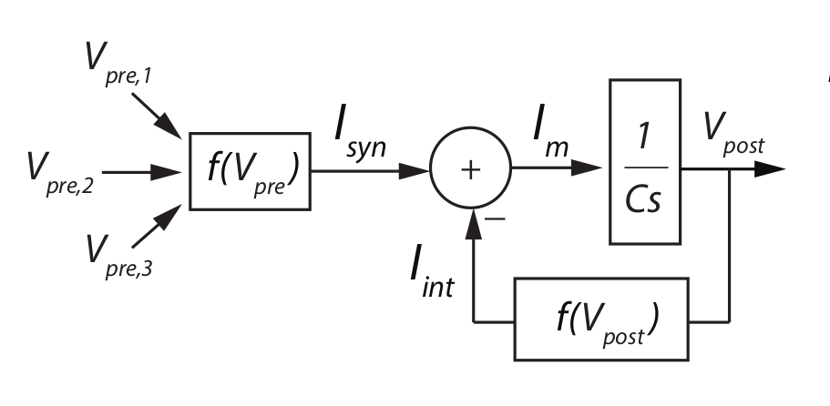

brc-pytorch
===========

PyTorch implementation of the bistable recurrent cell (BRC) from the paper [_A bio-inspired bistable recurrent cell allows for
long-lasting memory_ (Vecoven et al., 2020)](https://arxiv.org/abs/2006.05252).



Install
-------

```bash
pip install brc-pytorch
```

Usage
-----

```python
import torch

from brc_pytorch import utils
from brc_pytorch.modules import BRC, NBRC, StackedRNN

brc = StackedRNN(
    cell=BRC,  # NBRC for the neuromodulated version
    input_size=128,
    hidden_size=256,
    num_layers=3
).cuda()

# [ seq_len, batch_size, dim ]
x = torch.randn(64, 32, 128).cuda()

init_hidden = brc.init_hidden(batch_size=32)
out, hidden = brc(x, init_hidden)

# Detach hidden for next call
hidden = utils.detach_hidden(hidden)
```

Performance
-----------

The implementation is written in TorchScript (a subset of Python) and makes use of the PyTorch JIT compiler for a more efficient execution.

In my not really statistically significant experiments, the implementation seems to be about half as fast as the cuDNN based reference LSTM implementation with modest batch sizes and sequence lengths which can be considered pretty solid for a non-CUDA implementation.

**Update (2023/07)**

A lot has happened since the last real update of this repository. [PyTorch 2.0](https://pytorch.org/blog/pytorch-2.0-release/) has introduced a new dynamic compilation system, which, to my understanding, should replace the old scripting API. After doing a quick test, it seems that the code is still working without issues with the scripting API and can in principle also be compiled with `torch.compile`. However, it does not seem to run faster, perhaps even slower, and would need an adaption to the new compilation system.

References
----------

```bibtex
@misc{vecoven2020bioinspired,
    title={A bio-inspired bistable recurrent cell allows for long-lasting memory},
    author={Nicolas Vecoven and Damien Ernst and Guillaume Drion},
    year={2020},
    eprint={2006.05252},
    archivePrefix={arXiv},
    primaryClass={cs.NE}
}
```